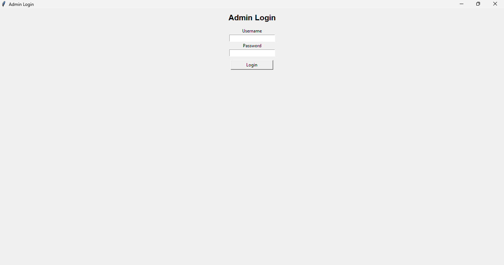
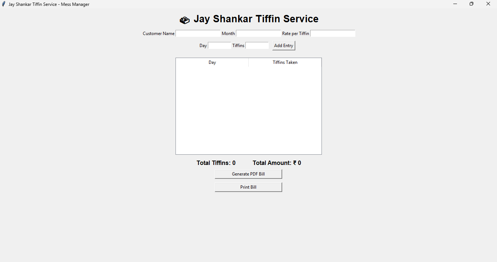
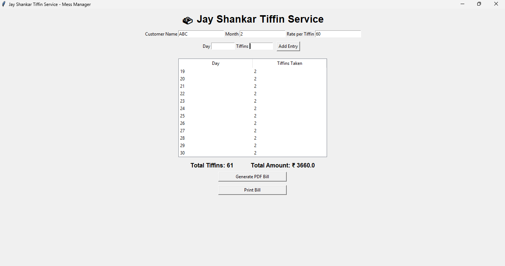
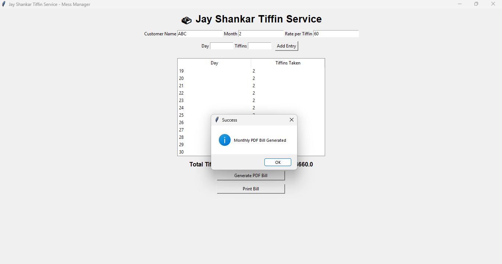
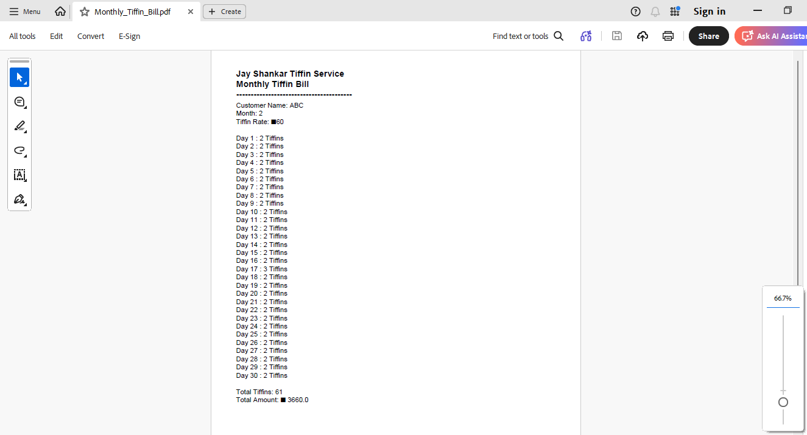

# 🍱 Jay Shankar Tiffin Service - Mess Manager

A GUI-based Tiffin Management System built using Python and Tkinter.

## 🔹 Features
- Admin Login System
- Add daily tiffin entries
- Automatic total calculation
- Generate Monthly PDF Bill
- Print Bill option

## 🔹 Technologies Used
- Python
- Tkinter
- ReportLab (for PDF generation)

## 🔹 How to Run
1. Install Python
2. Install reportlab:
   pip install reportlab
3. Run:
   python main.py

## 🔹 Default Login
Username: ADMIN
Password: admin
"# Tiffin-Mess-Manager" 

